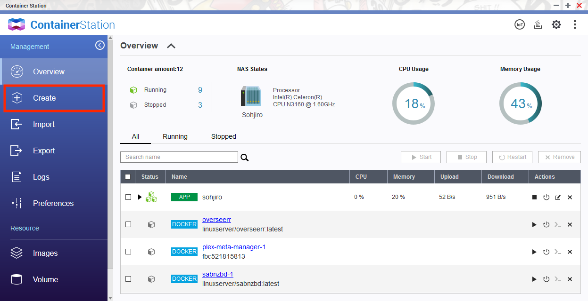
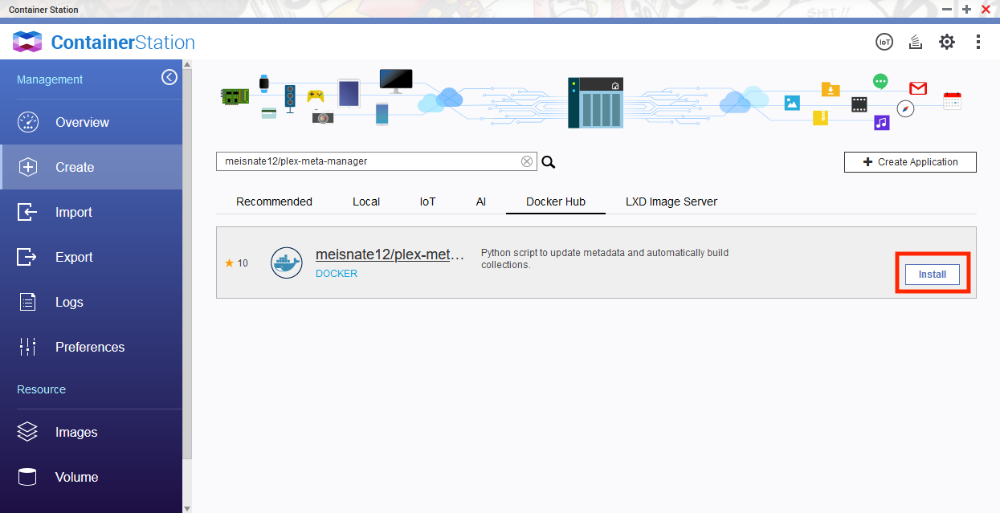
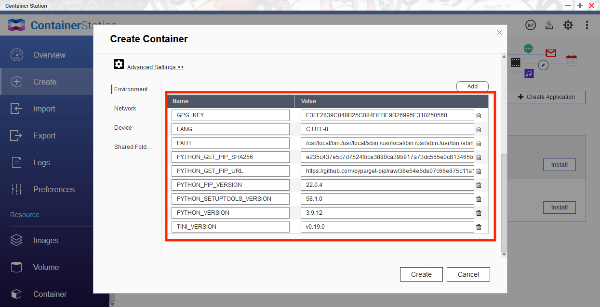
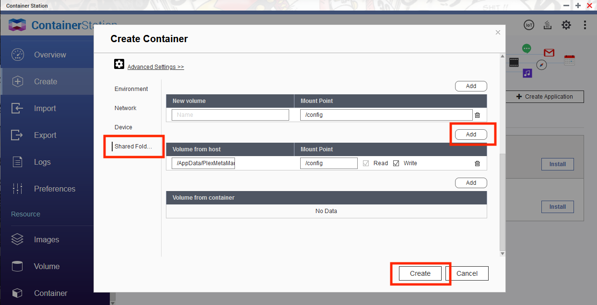

# QNAP Walkthrough

This is a quick walkthrough of setting up the Plex Meta Manager Docker container in the QNAP "Container Station" UI.

Steps.
1. Open Container Station; click "Create" in the left column.

   

2. Search for `meisnate12/plex-meta-manager`.

   On the "Docker Hub" tab you should see the image; click on it and click "Install".

   

1. Select the version you want to run from the dropdown and click "Next".

   The options are:
    - `latest`: most recent official release; typically the most stable
    - `develop`: development release, contains new features that haven't made it to latest yet, but may have minor problems
    - `nightly`: bleeding-edge development version; latest fixes go here, but breakage should be expected.

   

2. Change the container name if you wish.

   Command line arguments can be entered in the "Entrypoint" field after `/tini -s python3 plex_meta_manager.py --`  IMPORTANT: DO NOT REMOVE ANY ELEMENT OF THAT COMMAND.

   For example: `/tini -s python3 plex_meta_manager.py -- --run`

   Information on available command line argument can be found [here](../environmental)

   Click "Advanced Settings >>"

   

3. Environment Variables can be added here:

   Information on available Environment Variables can be found [here](../environmental)

   

4. Click Shared Folders Tab:

   Click "Add" in the middle section "Volume from host".

   "Volume from host" is the location on your QNAP where you want to store the config files.
   "Mount Point" must be `/config`

   When finished, click "Create".

   

