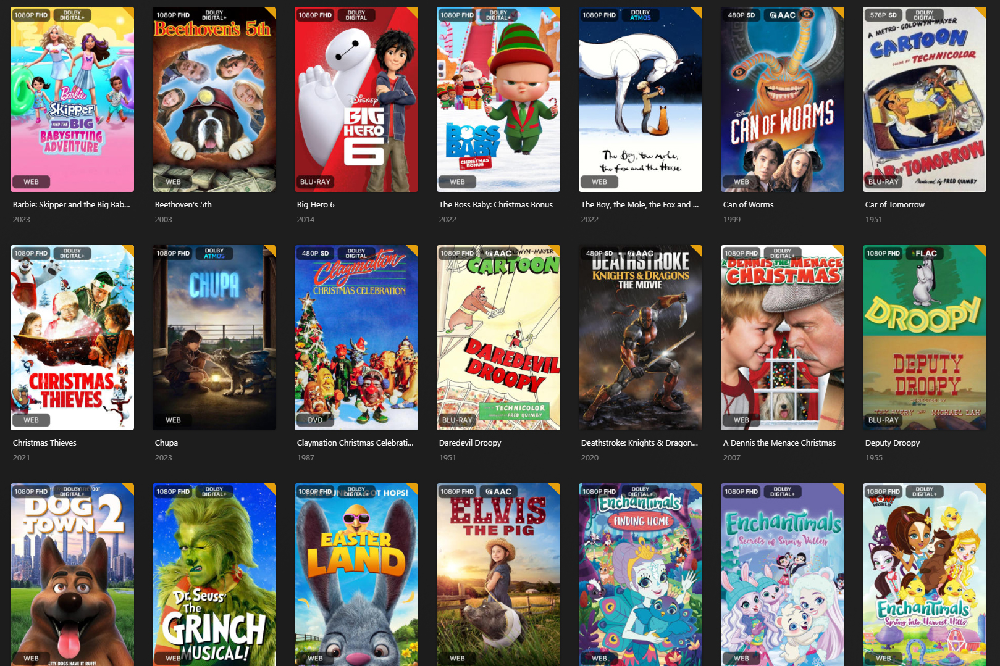
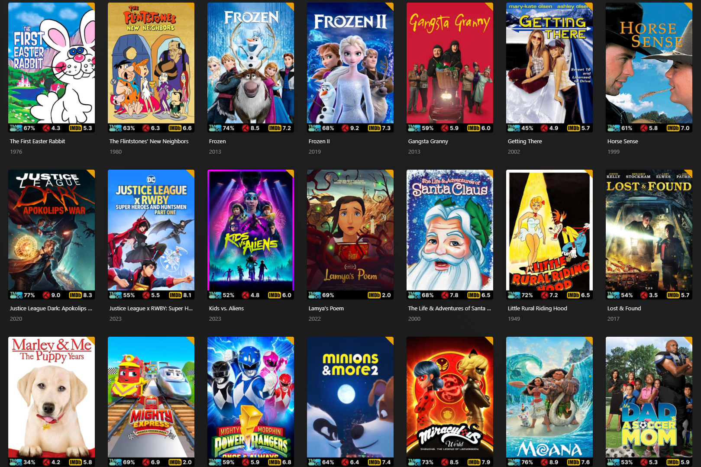

# Overlays Showcase

This page is designed to show the art of the possible when using Overlays within Plex Meta Manager.

Each showcased photo has been confirmed to be fully functional with Plex Meta Manager v1.19.0. We cannot guarantee functionality beyond that version.

## Example 1

=== "Example 1"

    {width="600" align=left loading=lazy }
    
    This example shows a minimalistic Overlay application with the resolution, audio codec and video format on display.

    This example uses three PMM Default Overlay files: [Resolution](../defaults/overlays/resolution.md), [Audio Codec](../defaults/overlays/audio_codec.md) and [Video Format](../defaults/overlays/video_format.md).

    Resolution is used to identify if the movie is 4K for example, and also highlights if a movie is Dolby Vision or HDR.

    Audio Codec is used to identify what format the audio is in (such as Dolby Digital or Dolby ATMOS)

    Video Format is used to identify the source of a file (such as a DVD rip or a WEB rip)

    **Click the image to enlarge it**

=== "Click to view Example 1 code"

    This code belongs in config.yml

    ```yml
    libraries:
      Movies:
        overlay_path:
        - pmm: resolution
        - pmm: audio_codec
        - pmm: video_format
    ```

    **Replace `Movies` with the name of your library**

## Example 2

=== "Example 2"

    {width="600" align=left loading=lazy }
    
    This example shows a minimalistic Overlay application with the ratings and ribbon of the movie.

    This example uses two PMM Default Overlay files: [Ratings](../defaults/overlays/ratings.md) and [Ribbon](../defaults/overlays/ribbon.md).

    Ratings are set to show the Rotten Tomatoes Audience & Critic scores, as well as the IMDb score.

    Custom fonts have been used for the ratings which can be sourced in [bullmoose20's repository](https://github.com/meisnate12/Plex-Meta-Manager-Configs/tree/master/bullmoose20) within `fonts.zip`

    A [Library Operation](../config/operations/#mass--rating-update) is used to place the IMDb rating into the user rating slot, as can be seen in the code example.

    **Click the image to enlarge it**

=== "Click to view Example 2 code"

    This code belongs in config.yml

    ```yml
    libraries:
      Movies:
        overlay_path:
        - pmm: ratings
          template_variables:
            rating1: critic
            rating1_image: rt_tomato
            rating1_font: config/overlays/fonts/Adlib.ttf
            rating1_font_size: 63
            rating2: audience
            rating2_image: rt_popcorn
            rating2_font: config/overlays/fonts/Adlib.ttf
            rating2_font_size: 63
            rating3: user
            rating3_image: imdb
            rating3_font: config/overlays/fonts/Impact.ttf
            rating3_font_size: 70
            horizontal_position: left
            vertical_position: bottom
            rating1_vertical_offset: 30
            rating2_vertical_offset: 30
            rating3_vertical_offset: 30
            rating1_horizontal_offset: 30
            rating2_horizontal_offset: 250
            rating3_horizontal_offset: 470
        - pmm: ribbon
        operations:
          mass_user_rating_update: imdb
    ```

    **Replace `Movies` with the name of your library** and **Set the font location to wherever you place them**


## Example 3

=== "Example 3"

    {width="600" align=left loading=lazy }
    
    This example shows a minimalistic Overlay application with the ratings applied at the bottom of the poster

    This example uses two PMM Default Overlay files: [Ratings](../defaults/overlays/ratings.md) and [Runtimes](../defaults/overlays/runtimes.md).

    Ratings are set to show the TMDb, Trakt and IMDb ratings, which have been set using [Library Operations](../config/operations/#mass--rating-update)

    The runtimes overlay is modified to show no text, but to instead produce the black bar which the ratigns sit on top of.

    **Click the image to enlarge it**

=== "Click to view Example 3 code"

    This code belongs in config.yml

    ```yml
    libraries:
      Movies:
        overlay_path:
        - pmm: runtimes
          template_variables:
            text: ""
            horizontal_position: center
            rating_alignment: horizontal
            vertical_position: bottom
            back_width: 2500
            back_radius: 1
            back_color: "#000000"
            horizontal_offset: 0
            vertical_offset: 0
        - pmm: ratings
          template_variables:
            rating1: critic
            rating1_image: tmdb
            rating2: audience
            rating2_image: trakt
            rating3: user
            rating3_image: imdb
            horizontal_position: center
            rating_alignment: horizontal
            vertical_position: bottom
            back_width: 1
            back_radius: 0
            back_height: 40
            back_color: "#000000"
        operations:
          mass_critic_rating_update: tmdb
          mass_audience_rating_update: trakt
          mass_user_rating_update: imdb
    ```

    **Replace `Movies` with the name of your library**
